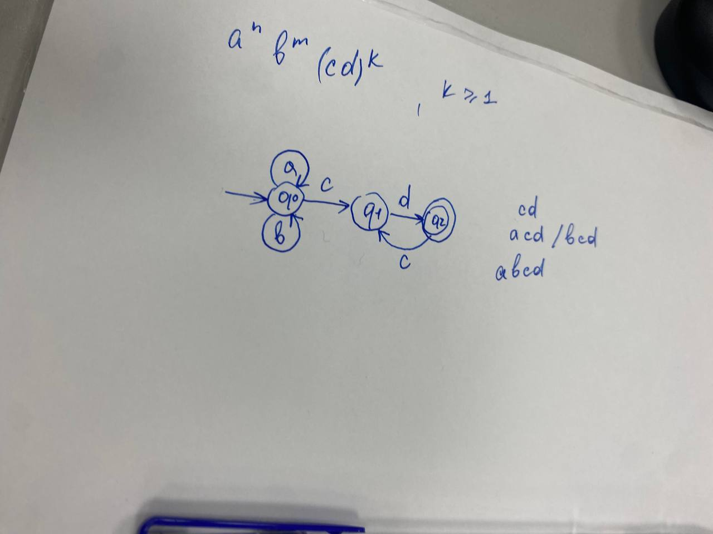

# Лабораторная работа №1

**Тема:** Реализация конечного автомата для распознавания формальных языков


## Постановка задачи

В рамках лабораторной работы необходимо разработать программное решение, реализующее детерминированный конечный автомат, предназначенный для распознавания слов формального языка, заданного согласно индивидуальному варианту.

Каждый вариант определяет общий вид допустимых слов посредством регулярного выражения с параметрами (степенями повторения блоков) и набором ограничений на эти параметры. Корректным считается слово, структура которого в точности соответствует заданному шаблону и удовлетворяет всем указанным условиям на количество повторений блоков.

Для выполнения лабораторной работы необходимо нарисовать диаграмму конечного автомата, а уже после реализовать решение на любом предпочитаемом яыке программирования.

Разрабатываемое решение должно принимать на вход произвольную последовательность символов, выполнять её последовательный анализ средствами конечного автомата и формировать однозначное заключение о принадлежности либо непринадлежности входного слова заданному языку.

Дополнительно, в рамках самостоятельной проработки, предусматривается верификация реализованного решения на репрезентативной выборке корректных и некорректных входных данных с целью подтверждения устойчивости, детерминированности и надёжности работы автомата на всём диапазоне возможных сценариев.

## Вариант задания

13. `aⁿbᵐ(cd)ᵏ`, n ≥ 0, m ≥ 0, k ≥ 1

### Диграмма конечного автомата


### Решение на языке джава с использовальнием регулярного выражения:

```java
import java.io.BufferedReader;
import java.io.IOException;
import java.io.InputStreamReader;
import java.util.regex.Pattern;

/**
 * Вариант 13: язык a^n b^m (cd)^k,  n>=0, m>=0, k>=1
 */
public class Variant13Regex {

    private static final Pattern LANGUAGE = Pattern.compile("a*b*(cd)+");

    static boolean belongsToLanguage(String word) {
        return LANGUAGE.matcher(word).matches();
    }

    public static void main(String[] args) {
        String[] correct   = {"cd", "acd", "bcd", "abcd", "aabbcd", "cdcdcd", "aabbcdcdcd"};
        String[] incorrect = {"", "a", "ab", "c", "ba", "cda", "cdb", "aabbc"};

        System.out.println("Должны быть приняты:");
        for (String w : correct) {
            System.out.printf("  %-12s -> %s%n", "'" + w + "'", belongsToLanguage(w));
        }

        System.out.println("Должны быть отвергнуты:");
        for (String w : incorrect) {
            System.out.printf("  %-12s -> %s%n", "'" + w + "'", belongsToLanguage(w));
        }

        System.out.println("\nВведите слово для проверки (пустая строка — выход):");
        BufferedReader reader = new BufferedReader(new InputStreamReader(System.in));
        try {
            String line;
            while ((line = reader.readLine()) != null) {
                String w = line.trim();
                if (w.equalsIgnoreCase("stop")) break;
                if (w.isEmpty()) break;
                System.out.println(belongsToLanguage(w) ? "принято" : "отвергнуто");
            }
        } catch (IOException e) {
            System.out.println("Ошибка чтения ввода: " + e.getMessage());
        }
    }
}
```